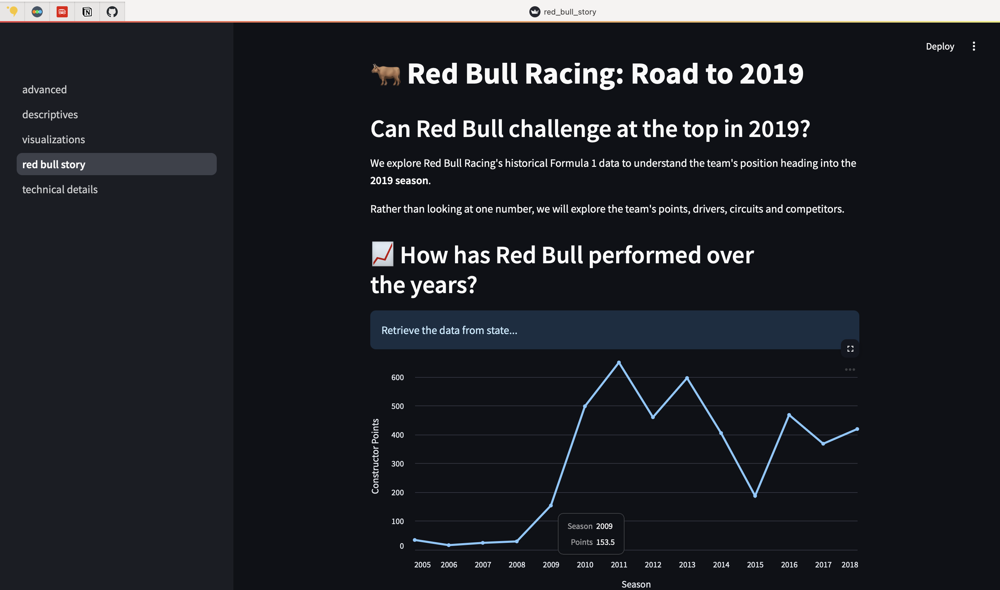
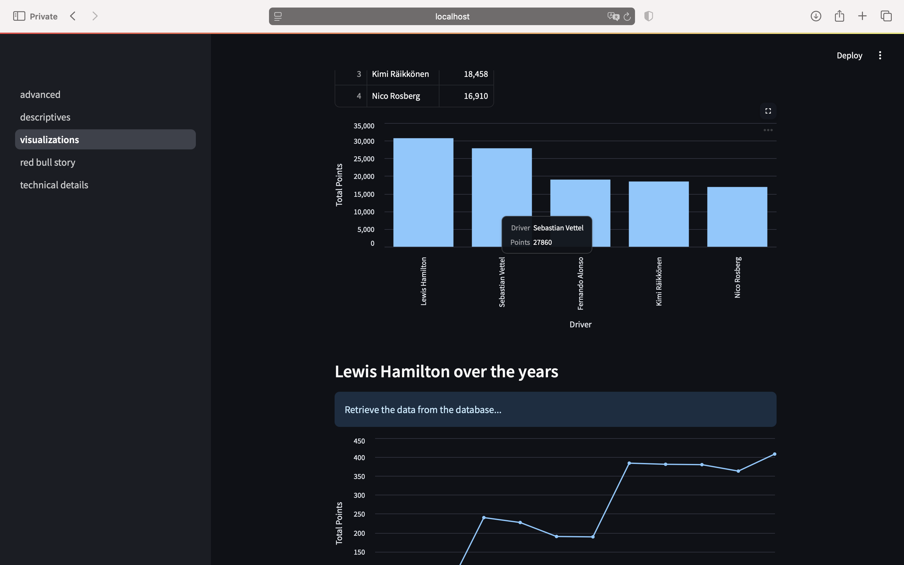
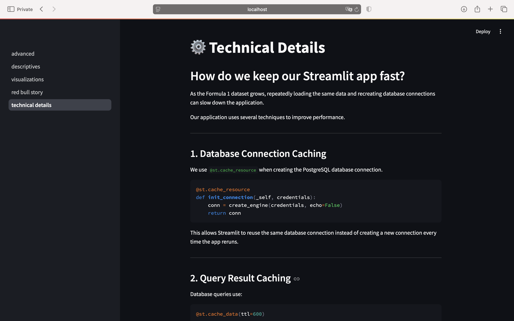
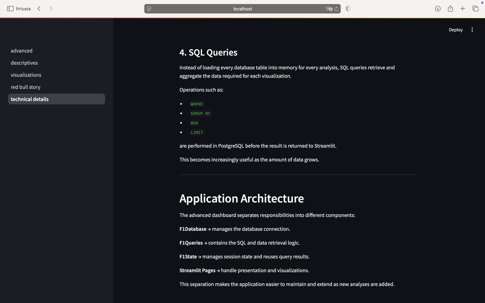

# 🏎️ Formula 1 Streamlit Dashboard

An interactive Formula 1 analytics dashboard built with **Streamlit, PostgreSQL, Docker, SQL, Pandas, and Altair**.

The project combines data engineering and visualization in a multi-page web application. It explores Formula 1 data, provides descriptive statistics and driver visualizations, and includes a focused **Red Bull Racing analysis heading into the 2019 season**.

## 📸 Dashboard Preview

### 🐂 Red Bull Racing — Road to 2019

A data-storytelling view exploring Red Bull Racing's historical performance and position heading into the 2019 Formula 1 season.



### 📊 Formula 1 Visualizations

Interactive visualizations explore driver performance, including the top Formula 1 drivers and Lewis Hamilton's performance across seasons.



### ⚡ Performance & Caching

The application uses Streamlit caching and session state to reduce repeated database work and improve performance.



### 🏗️ Application Architecture

SQL filtering and aggregation are performed in PostgreSQL before results are returned to the application, while responsibilities are separated across database, query, state, and presentation layers.



## ✨ Project Highlights

- Multi-page Streamlit dashboard
- PostgreSQL database running in Docker
- SQL-based data extraction and aggregation
- Interactive Altair visualizations
- Descriptive statistics for Formula 1 tables
- Top-driver and Lewis Hamilton performance analysis
- Red Bull Racing storytelling page
- Session-state and caching strategies for better app performance
- Object-oriented structure with separation of concerns

## 📊 Dashboard Pages

### 1. Descriptive Statistics

Explore Formula 1 database tables from the sidebar, display the selected data, and generate summary statistics with Pandas.

### 2. Data Visualizations

Includes visual analysis such as:

- Top 5 Formula 1 drivers by points
- Lewis Hamilton's points across seasons

### 3. Red Bull Racing — Road to 2019

A data-storytelling page that uses historical results to explore Red Bull's position heading into the 2019 season.

The analysis covers:

- Red Bull constructor points over the years
- The team's 2018 drivers
- Driver performance
- High-performing drivers from other teams to consider
- Historically strong and weak circuits
- Red Bull's closest competitors in the 2018 constructor standings

### 4. Technical Details

Explains how the application is structured and how repeated work is reduced as the application grows, including:

- `st.cache_resource` for the database connection
- `st.cache_data` for SQL query results
- `st.session_state` for reusing data during a session
- SQL filtering and aggregation before data reaches the UI

## 🏗️ Architecture

```text
PostgreSQL
    ↓
F1Database
    ↓
F1Queries
    ↓
Pandas DataFrames
    ↓
F1State / Streamlit Cache
    ↓
Streamlit Pages
    ↓
Tables + Interactive Charts + Storytelling
```

The advanced application separates responsibilities across modules:

```text
f1dashboard/
├── advanced.py                 # Main Streamlit entry point
├── basic.py                    # Initial single-page implementation
├── advanced/
│   ├── database.py             # PostgreSQL connection
│   ├── queries.py              # SQL queries and transformations
│   ├── state.py                # Session-state logic
│   └── constants.py            # Database table names
└── pages/
    ├── 01_descriptives.py
    ├── 02_visualizations.py
    ├── 03_red_bull_story.py
    └── 04_technical_details.py
```

## 🛠️ Tech Stack

| Technology | Purpose |
| --- | --- |
| Python | Application and analysis logic |
| Streamlit | Interactive web dashboard |
| PostgreSQL | Formula 1 data storage |
| SQLAlchemy | Database connection layer |
| SQL | Data querying and aggregation |
| Pandas | Data manipulation |
| Altair | Interactive visualizations |
| Docker & Docker Compose | Reproducible local environment |
| Poetry | Python dependency management |

## 🚀 Running the Project Locally

### Prerequisites

You need:

- Docker / Docker Compose
- The Formula 1 PostgreSQL dump (`f1db.sql`)

### 1. Clone the repository

```bash
git clone git@github.com:wsaiff/f1-streamlit-dashboard.git
cd f1-streamlit-dashboard
```

### 2. Add the Formula 1 database dump

Place the SQL dump here:

```text
database/init/f1db.sql
```

The dataset dump is intentionally not committed to this repository.

### 3. Create the environment file

```bash
cp .env.sample .env
```

The sample uses:

```text
POSTGRES_PASSWORD=postgres
```

You can replace it with your own local password.

### 4. Create Streamlit secrets

```bash
cp .streamlit/secrets.toml.example .streamlit/secrets.toml
```

Make sure the PostgreSQL password matches the value in `.env`.

### 5. Start the application

```bash
docker compose -f docker-compose-advanced.yml up --build
```

Then open:

```text
http://localhost:8501
```

To stop the application:

```bash
docker compose -f docker-compose-advanced.yml down
```

## ⚡ Performance Approach

The dashboard avoids unnecessary repeated work in several ways:

- The SQLAlchemy engine is reused with `@st.cache_resource`.
- Query results are cached for 10 minutes with `@st.cache_data(ttl=600)`.
- `st.session_state` stores data that has already been retrieved during the user's session.
- SQL performs filtering and aggregation in PostgreSQL before returning results to Streamlit.

These choices reduce repeated database calls and keep the application responsive as users move between pages.

## 🎯 What I Practiced

This project brought together several parts of a data-engineering workflow: containerized services, PostgreSQL, SQL querying, Python data manipulation, caching, application structure, and interactive data storytelling in Streamlit.

---

Built as a Formula 1 data engineering and visualization project.